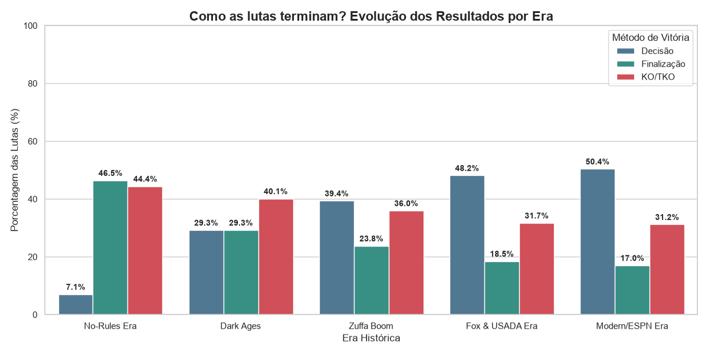
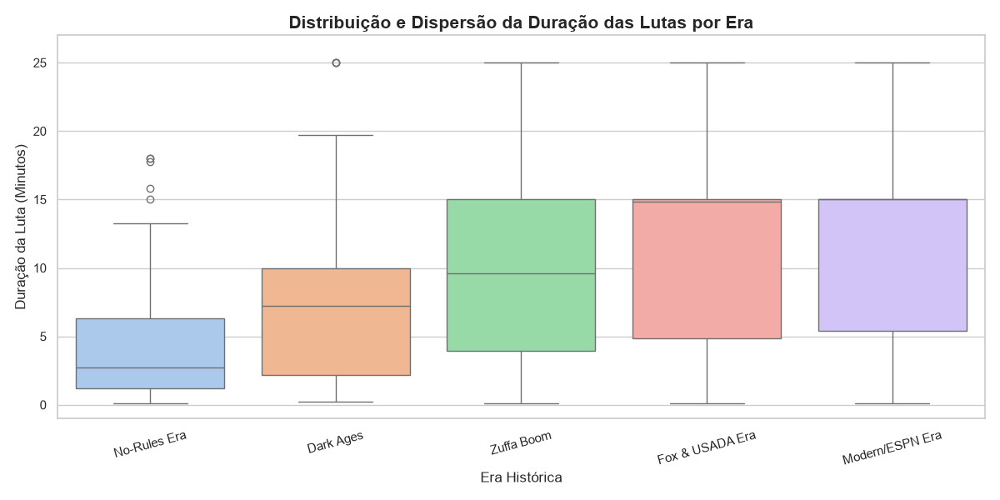
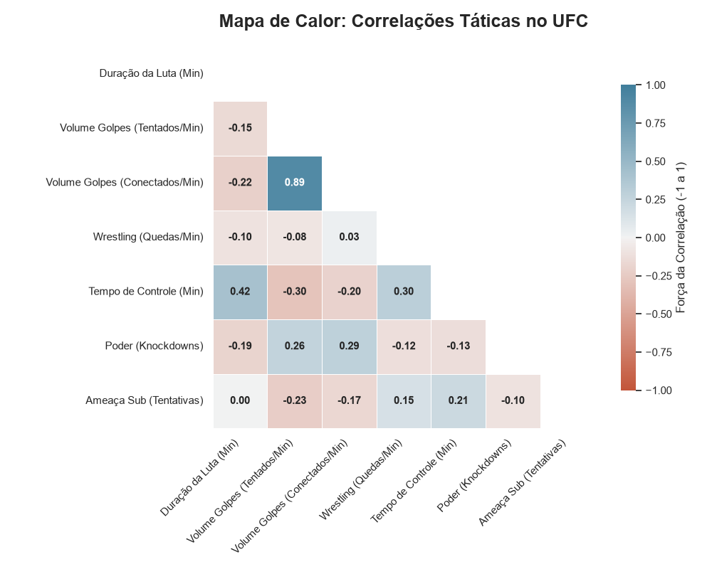

<div align="center">
  <h1>🥊 Análise Exploratória e Evolução Tática do UFC</h1>
  <p><i>Projeto acadêmico analisando como o maior evento de MMA do mundo evoluiu de uma "briga de estilos puros" para um esporte híbrido de altíssima performance.</i></p>

  
  
  
</div>

<br>

## 📌 Sobre o Projeto
Este repositório contém o projeto final para a disciplina de **Análise Exploratória e Visualização de Dados**. Utilizando uma base de dados histórica do UFC (Ultimate Fighting Championship), aplicamos técnicas de limpeza, engenharia de atributos (Feature Engineering) e visualização estatística para descobrir padrões táticos ao longo das eras.

## 📂 Estrutura do Repositório
Para manter a organização, o projeto foi dividido nas seguintes pastas:

* `data/`: Contém o dataset processado (`ufc_gold_dataset_final.csv`).
* `scripts/`: Código-fonte em Python contendo a pipeline de limpeza e as gerações dos gráficos.
* `graphs/`: Imagens em alta resolução geradas pelas análises.

---

## 📊 Principais Descobertas e Visualizações

### O Declínio do Jiu-Jitsu e a Ascensão das Decisões
Analisando os métodos de vitória desde 1993, fica evidente a padronização do esporte. As finalizações (Submissions), que dominavam os primórdios do UFC, sofreram uma queda brusca, dando lugar a combates mais equilibrados que terminam na decisão dos juízes.

<div align="center">
  
</div>

### A Estabilização do Tempo de Luta (Boxplot)
Através da análise de distribuição do tempo de octógono, podemos observar que a duração das lutas se tornou muito mais previsível. O esporte deixou de ter combates relâmpagos extremos para seguir um padrão tático onde os atletas cadenciam a luta até o limite de tempo.

<div align="center">
  
</div>

### Correlações Táticas: O Mapa do Estilo de Luta
O mapa de calor abaixo valida estatisticamente as dinâmicas do octógono usando a correlação de Pearson. O grande destaque é a correlação negativa de **-0.30** entre o **Tempo de Controle (Min)** e o **Volume de Golpes (Tentados/Min)**. Aliado ao fato de que o Wrestling possui uma correlação positiva de **0.30** com esse tempo de controle, a matemática dita a clara mudança tática: atletas que impõem o jogo agarrado conseguem neutralizar o ímpeto dos trocadores, derrubando drasticamente o volume de golpes tentados na luta através do abafamento e do domínio posicional.

<div align="center">
  
</div>

---

## 🗄️ Fonte dos Dados e Metodologia
A base de dados foi estruturada com informações históricas do UFC. O grande diferencial deste projeto foi a aplicação de **Engenharia de Atributos (Feature Engineering)**. 
Como as lutas possuem durações variadas (desde nocautes em 10 segundos até decisões de 25 minutos), comparar volumes absolutos de golpes seria um erro estatístico. Para resolver isso, criamos métricas proporcionais, dividindo as ações pelo tempo de octógono, resultando em métricas justas de **"Ações Por Minuto"** (ex: *Quedas/Min*, *Golpes/Min*).

---

## 🚀 Como Executar Localmente

```bash
# Clone o repositório
git clone https://github.com/Ferthanks/ufc-data-analysis.git

# Navegue até a pasta do projeto
cd ufc-data-analysis

# Instale as dependências
pip install -r requirements.txt

# Execute os scripts
cd scripts
python heatmap.py
